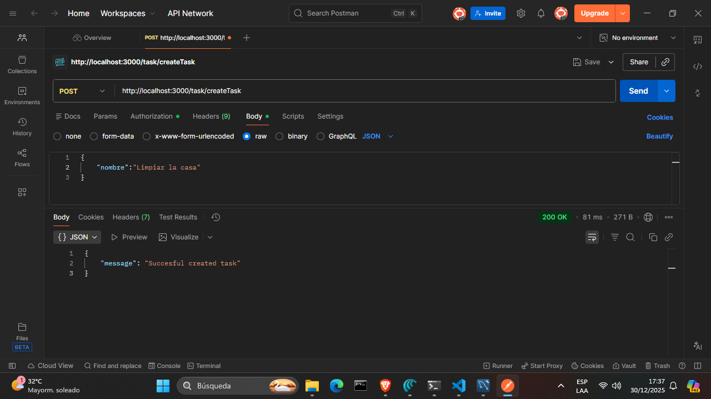
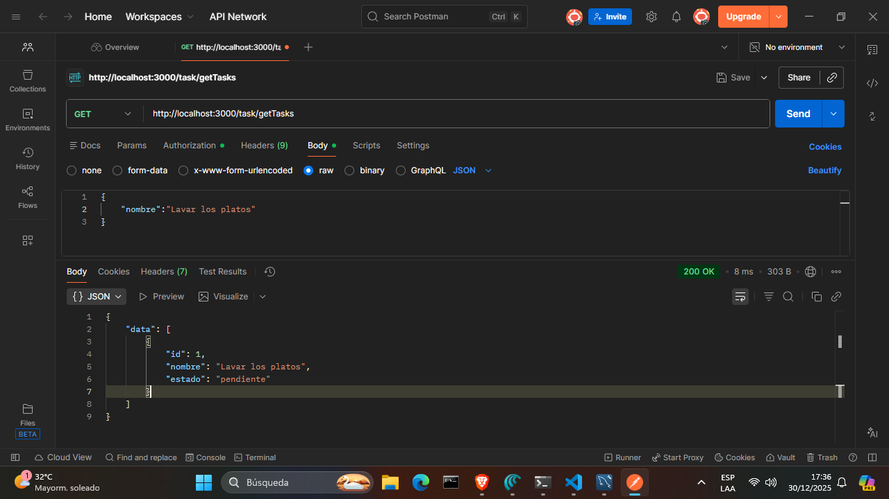
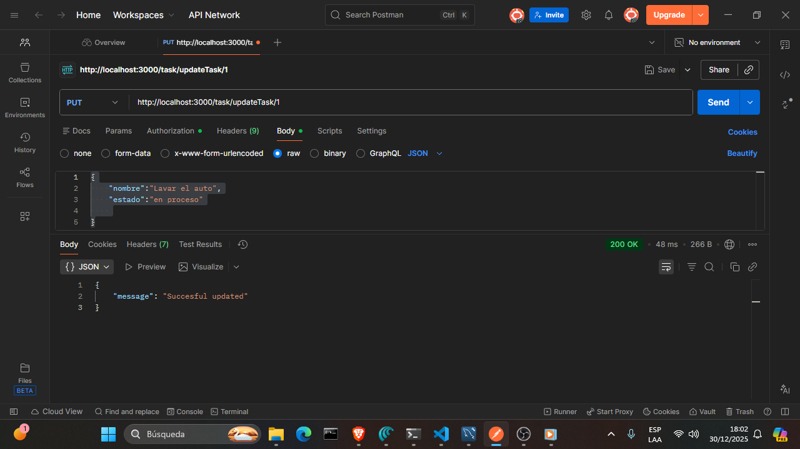

 

  <h3 align="center">Task List CRUD API</h3>

  

    Backend RESTful para gestión de tareas con estados y operaciones CRUD completas.
     
     
  

---

## 📌 Descripción del proyecto

**Task List CRUD API** es una API RESTful desarrollada con **Node.js, Express, TypeScript y MySQL** que permite gestionar tareas de forma simple y escalable.

Cada tarea cuenta con:
- Un **nombre**
- Un **estado** controlado (`pending`, `in_progress`, `completed`)
-

El proyecto está pensado como base sólida para:
- Aplicaciones web
- Dashboards
- Sistemas de productividad
- Pruebas técnicas backend

---

## 🧠 Funcionalidades principales

- Crear una tarea
- Listar todas las tareas
- Actualizar el estado de una tarea
- Eliminar una tarea
- Validación de estados permitidos
- Arquitectura clara y mantenible

---

## 🛠️ Tecnologías utilizadas

- **Node.js** – Runtime
- **Express.js** – Framework HTTP
- **TypeScript** – Tipado estático
- **MySQL** – Base de datos relacional

---

---

## 🚀 Inicio del proyecto

### Requisitos previos

- Node.js >= 18
- MySQL
- npm

---

### Instalación

1. Clonar el repositorio
sh
git clone https://github.com/AlanBenjaDev/task-list-crud.git

2. instalar dependencias
  npm install

3.Configurar .env
DB_HOST=localhost
DB_USER=root
DB_PASSWORD=your_password
DB_NAME=task_db
PORT=3000

4-Ejecutar proyecto
npm run dev

Modelo de datos
Tabla tareas
CREATE TABLE tasks (
  id INT AUTO_INCREMENT PRIMARY KEY,
  title VARCHAR(255) NOT NULL,
  status ENUM('pending', 'in_progress', 'completed') DEFAULT 'pending',
  created_at TIMESTAMP DEFAULT CURRENT_TIMESTAMP,
  updated_at TIMESTAMP DEFAULT CURRENT_TIMESTAMP ON UPDATE CURRENT_TIMESTAMP
);

Testing

La API puede probarse utilizando:

Postman

Insomnia

cURL

Incluye validaciones básicas para evitar estados inválidos.

📈 Roadmap

 Autenticación JWT

 Filtros por estado

 Paginación

 Soft delete

 
 Imagenes de los test en Potsman

 

